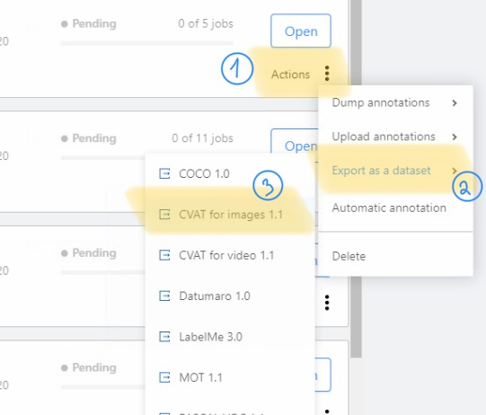

# CVAT facial landmarks annotation
These scripts aim to facilitate the process of manual facial landmarks labeling with the help of the CVAT tool.  
The project uses 68 facial keypoints model for annotation but can be modified to any number of keypoints.

# Table of contents
1. [Installation](#Installation)
2. [Create automatic annotations](#create-automatic-annotations)
3. [Working with CVAT](#working-with-cvat)
4. [Data postprocessing](#data-postprocessing)

General workflow:
- Process videos to extract distinguishable frames
- Process images to get .npy files with programmatically annotated landmarks
- Generate .xml files with annotations for importing in CVAT
- Manually fix problematic keypoints
- Export from CVAT .xml with corrected annotations
- Extract new keypoints from .xml and use them for a keypoints custom detector training 

## Installation
Scripts are Python 3.8-based and are compatible with CVAT 1.1 [(release)](https://github.com/openvinotoolkit/cvat/releases/tag/v1.1.0)
```
pip install -r requirements.txt

git lfs fetch
git lfs pull
```
## Create automatic annotations
Usecases:
- images
- videos

**videos**  
If you have a frontal face video (for example a recording from a webcam where only one face is visible) and want to extract only distinctive frames, use video_processing script:
```
cd automatic_annotation
python -m video_processing.extract_frames [path to a directory with videofiles]
```
This script is based on the [head_pose_estimation](https://github.com/yinguobing/head-pose-estimation) repository ([branch `tf2`](https://github.com/yinguobing/head-pose-estimation/tree/tf2)). It selects video frames where a cumulative change in pitch, yaw, roll of the head is larger than 15 degrees and creates a directory with extracted frames within the same directory.  

**images**  
CVAT has a size limit for an uploading directory. If you hit the limit, you can split your dataset into N parts by providing an N cmd argument (1 by default).
```
cd automatic_annotation
python -m image_processing.images_landmarks [path to a directory with images] [N parts (optional)]
```
## Working with CVAT
> [CVAT] is free, online, interactive video and image annotation tool  for computer vision

You can use provided by [CVAT] demo-server ([link](https://cvat.org/)) or host in on a custom server.

Upload your data as a task:  
  
  

After task creation, add generated `.xml` annotations as `CVAT 1.1` file  
  


## Data postprocessing
When manual correction of keypoints is finished, download thr resulting annotation:  
  


If you want to train DLIB facial keypoints detector, generate reuslting .xml (or you can modify this script to your training format)  
```
python -m postprocess.convert_dataset [directory with dataset zip files]
```


[CVAT]: https://github.com/openvinotoolkit/cvat
